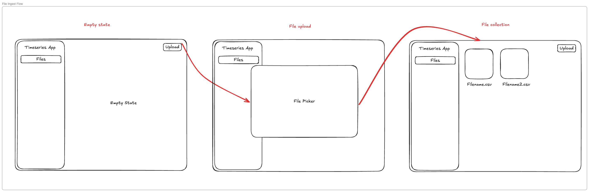

# Time series data app

Your task is to prototype a simple fullstack time series data app that accepts multiple flat file CSV’s from a web form and stores it in a database.

Notes & Tips for this challenge:

- This challenge should roughly take 1-2 hours
- This is an open-ended challenge, use your best judgement in areas that you feel have limited detail
- Use the tools and technologies you’re most comfortable with
- Take shortcuts if necessary, please comment in areas where you are taking a shortcut

## Tech stack

- App/API: use any programming languages, libraries, and/or framework.
- Database: any database, either through docker or using an embedded db like sqlite/duckdb

## Frontend UI/X Spec

- Build a basic web app that allows users to upload flat file CSV’s that contain time series measures
- The upload and UI/X should have the following flow:
  

## File Ingestion Spec

- Files expected will be flat file CSVs where the timestamp is expected to be the first column as `ts` and a variable number of measures will be the remaining columns. Expect the values of every measure to be a float type, see “Example file A” and “Example file B” below.
- Files ingested should be normalized into a timeseries format, see “Example of database table” below.

**Note:** Input data files can be found in the `./input_data/` directory

**Examples**

Example file A:

| ts                  | measure_a | measure_b |
| :------------------ | :-------- | :-------- |
| 2025-05-01 13:30:00 | 123       | 456       |
| …                   | …         | ..        |

Example file B:

| ts                  | measure_c | measure_d |
| :------------------ | :-------- | :-------- |
| 2025-12-02 09:00:00 | 789       | 987       |
| …                   | …         | ..        |

Example of database table:

| ts                  | source     | measure   | float_value |
| :------------------ | :--------- | :-------- | :---------- |
| 2025-05-01 13:30:00 | file_a.csv | measure_a | 123         |
| 2025-05-01 13:30:00 | file_a.csv | measure_b | 456         |
| …                   | …          | …         | …           |
| 2025-12-02 13:30:00 | file_a.csv | measure_c | 654         |
| 2025-12-02 13:30:00 | file_a.csv | measure_d | 321         |
| …                   | …          | …         | …           |

## Submission

You can submit to us using one of the two:

- Link to a github repository
- Zip file attached to email
